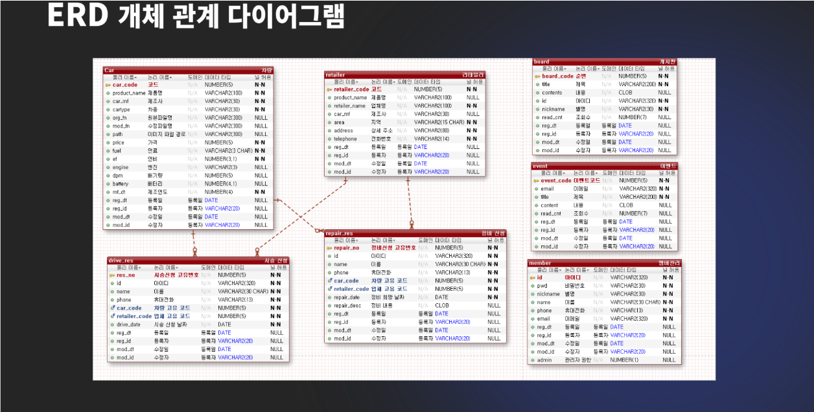
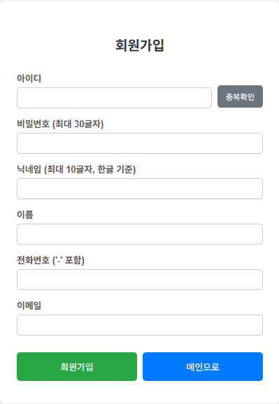
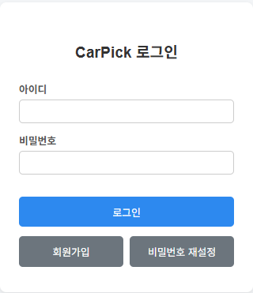
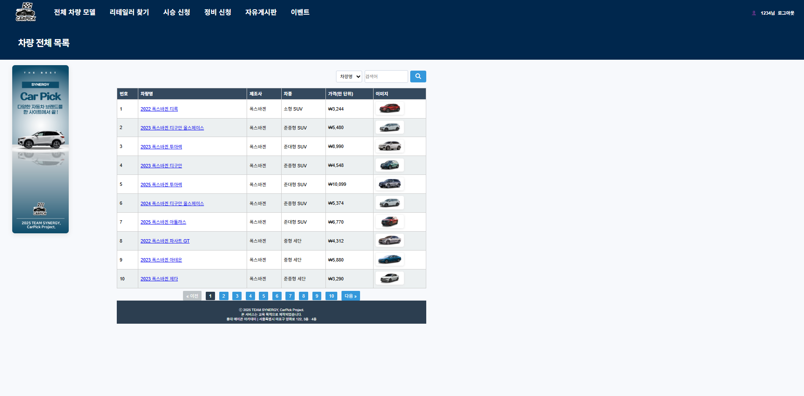
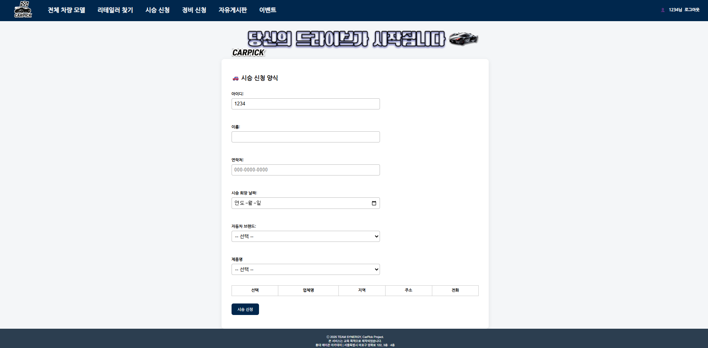
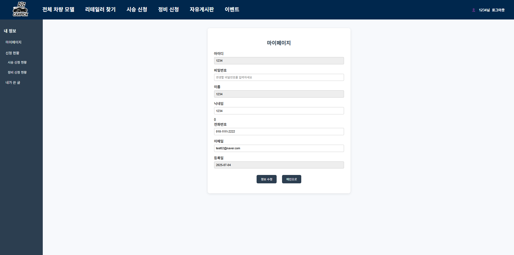
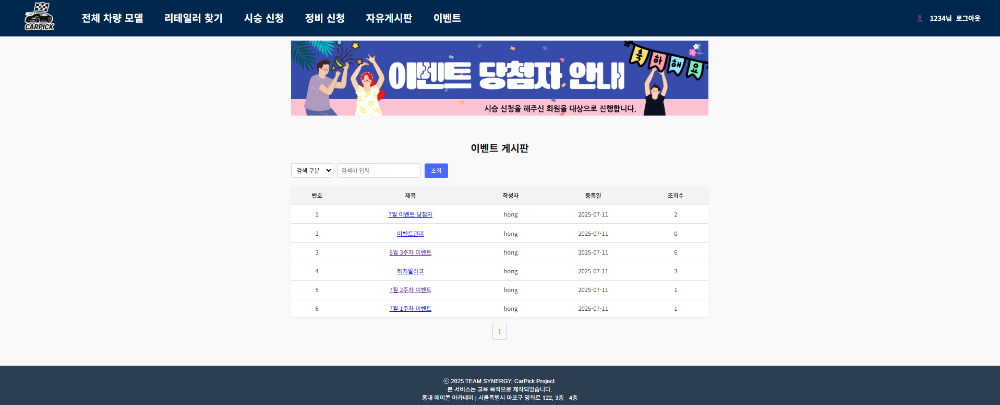
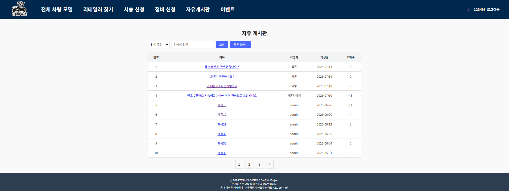

## 👨‍🏫 프로젝트 개요

# 🚘 Car Pick 프로젝트 개요 및 필요성

## 1. 자동차 산업의 변화와 온라인화
최근 자동차 산업은 빠르게 디지털화되고 있으며, 차량 정보 제공, 시승 예약, 정비 신청 등 전통적으로 오프라인에서 진행되던 서비스들이 온라인 플랫폼으로 옮겨지고 있습니다.  
소비자들은 더 많은 정보를 직접 비교하고 확인하려는 니즈가 강해지고 있습니다.

## 2. 정보 단절 문제와 통합 플랫폼의 필요성
브랜드별 웹사이트나 개별 리테일러를 통해 차량 정보나 신청을 따로 처리해야 하는 불편함이 존재합니다.  
이로 인해 소비자는 다양한 브랜드와 차종, 시승 및 정비 서비스를 일괄적으로 비교하거나 신청하는 데 제약을 받게 됩니다.  

➡️ 이런 문제를 해결하기 위해 **자동차 정보 통합 플랫폼**이 필요합니다.

# 🌟 서비스 컨셉 및 차별점

## 1. 다양한 브랜드 정보 통합 제공
- 국내외 다양한 자동차 브랜드의 차량 정보를 한곳에서 제공
- 연비, 연료, 차량 등급, 디자인 등 다양한 기준으로 비교 가능

## 2. 시승 및 정비 예약 시스템
- 원하는 차종과 리테일러 선택 → 시승 예약 가능
- 등록된 차량에 한해 정비 신청 기능 제공

## 3. 사용자 편의를 고려한 기능
- 브랜드, 차종, 연료 등 통합 검색 기능
- **시승 후기 게시판**, **차량 정보 공유 게시판** 제공
- 시승 신청 고객을 대상으로 **매월 10명 경품 이벤트** 진행

# 🛠 프로젝트 구현 목표 및 계획

## ✅ 목표
> 브랜드에 관계없이 차량 정보를 통합 제공하고,  
> 시승 및 정비 신청까지 가능한 온라인 플랫폼 구현

✔️ 팀 구성 및 역할  
* **이종민**(팀장) 🖥️ 회원가입, 회원관리, 차량관리, 리테일러 관리
* **가민경** 🖥️ 차량 시승 신청, 차량 정비 신청
* **송예림** 🖥️ 차량 정보 조회, 리테일러 검색
* **조경령** 🖥️ 게시판, 이벤트

## 🔖 WBS

## 📌 프로젝트 기능

- 하나의 브랜드가 아닌 다양한 차량 브랜드 검색
- 시승 신청 기능
- 예약 신청 기능
- 이벤트 정보 확인
- 게시판에 쓴 마이글 보기

## ⚙️ 기술 스택

Frontend

  

Backend

  

Database

Tools

  

# SYNERGY
## 📝요구사항 정의서

## 📝SYNERGY_ERD 설계서

* 회원가입/로그인

* 차량 신청 및 조회

* 마이페이지/이벤트/자유게시판

## 🖥️ WEB 소개 영상
https://youtu.be/YwntbXkUEH0
